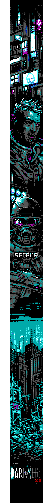

- 👋 Hi, I’m @752963e64
- 📫 How to reach me 752963e64@tutanota.com
- ✨ Pronouns: Where is money?
- ⚡ Fun fact: I need money.
- ✨ I'm POLYGLOT with both natural and programming languages ✨
- ✨ I don't come from cozy... younger fridge was void, parent absent. And I know the street! ✨

### ✨ You must master programming, To modify their modifications ✨

### ⚡ Don't trust *anything before deep inspection analysis... ⚡

- ⚡ ANYTHING is also PERSONA... ⚡

```
Why, how, lookup, understand, masters! Is my Mojo.
It applies naturally all the time to everything, even If I'm not looking to.
```

[Information Theory](https://en.wikipedia.org/wiki/Information_theory)

[Information Processing](https://en.wikipedia.org/wiki/Information_technology)

[Data Compression](https://en.wikipedia.org/wiki/Data_compression)

[Mathematics](https://en.wikipedia.org/wiki/Mathematics)

[Computer Science](https://en.wikipedia.org/wiki/Computer_science)

[Cybernetics](https://en.wikipedia.org/wiki/Cybernetics)

[The invention that changed the world!](https://www.youtube.com/watch?v=pQ2dI_B_Ycg)


```
I'm self taught engineer in system and network programming with different languages,
operating systems since the 2000 era. Meanwhile I did website prototypes from the ground up,
with and without HTTP server from scratch. I also have a dusty stack pile from prototyping
devices modules(AntMiner U1*7,arduino,buspirate,armv7 RPi like) taking the dust.
Yeah I did bitcoin before inflation, I even hacked first btc protocol...
I've been stole by Crypsty, Coinex.pw, Cex.io... then I left crypto.
Few years ago I started to have interest in game dev. So makes me a good generalist.
I read binary/source code like books.
I'm not an AI and I don't use AI to generate content I share. I'm not that void...
I've no interest in AI; for me a program well done always fit any automation process.
To be clearer, There is no need a reasoning layer on top algorithm that are already reasoning.
succinctly:
- senior system engineer (yeah let's make a crapy programming language jit or not...)
- senior security engineer (I don't write toys, I lock up things you wont bypass, because I can't too...)
These 2 cat. are more like local playground... graphics Is HIGHLY FLAWED FROM THE GROUND UP... :D
- intermediate UX devel (U wanna box cliping or do we play texture, the DE toolkit? maybe...)
- intermediate game devel (this object handles all the pnj on screen...)
```

### I'll try to say hello in a different way every night from hand.

"You've to hate things to move on the next one fiting the purpose. Only Aging let you understand this. Just don't be sarcastic."

```
$ cat m.c
#include <stdio.h>
#define _ $
#define o(_)\
(putchar(_))
int main(){char *c = \
"lolhe";o(*(c+3/0x1));\
o(*(c+4*1));o(*(c))\
;o(*(c+2*1));o(*(c+1))\
;o(054*1);o(0x20+2-2);c = \
"rdlw";o(*(c+3));o(*(c+3)-8)\
;o(*(c+5-1));o(*(c));o(*(c+2))\
;o(*(c+1/1));o(33+001*2/2-1);o(0b1010-0b0000);
return linux > unix;}
```

```
$ gcc -o m ./m.c && ./m && echo $?
```

```
hello, world!
0
```



<!---
752963e64/752963e64 is a ✨ special ✨ repository because its `README.md` (this file) appears on your GitHub profile.
You can click the Preview link to take a look at your changes.
--->
